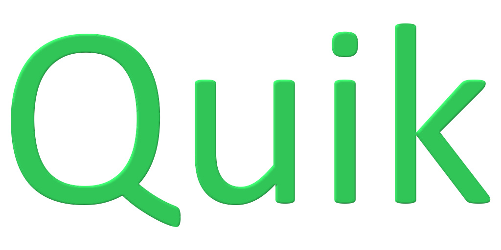

# QUIK
The quick utility add-on for Godot! Currently focused on debugging tools!

## Install and enable
To install and enable Quik, download the add-on on the asset lib.
Then go to ``Project > Plugins > Quik`` and press ``Enable``.

Quik will automatically add in a singleton ``q`` to the project.

## Using
Quik stores all utilities in one global letter called ``q``.

Here is all the utilities you can use!

## Examples
### Log to the screen
```py
# This will print to the screen "test: hello world".
# (quik).(debug).(log)
q.d.l('test', 'hello world!')

# We can update that text any time to something like this.
# (quik).(debug).(log)
q.d.l('test', 'we updated the text on the screen!')
```

### Track node variable and log to the screen
```py
# This will constantly update the info on the log of the player's position as it keeps track of the node information every frame.
# We are passing in the node (player) and the variable name on the node (position).
var player: KinematicBody2D = get_node('Player')
# (quik).(debug).(track)
q.d.t(player, 'position')
```

### Visually log position
```py
# This will display a square on the screen where the position is at.
# (quik).(debug visual).(position)
q.dv.p('test', Vector2(100, 100), 5, true)
```

### Visually track node position
```py
# This will constantly display a square on the screen of the player's global position as it keeps track of the node information every frame.
# We are passing in the node (player) and we give it a custom name to display on the screen. The name is required here currently for it to function properly.
var player: KinematicBody2D = get_node('Player')
# (quik).(debug visual).(track position)
q.dv.tp(player, 'player is here!', 5, true)
```

### Wait for ready state on node
```py
onready var label_node = get_node('Label')

var health = 100
func set_health(val):
	health = val
	# Waits for our own node to be ready before executing the next line of code
	# When this node is already ready, it will continue running instead of waiting
	yield(q.u.wfr(self), 'completed')
	if label_node:
		label_node.text = val

func _init(val):
	set_health(val)
```

## FAQ
### What is the license?
MIT License. It is located in LICENSE.md

### Is Quik only for debugging tools?
Currently right now it is, though there might be more in the future that might not be related to debugging.

### What is the point of using the logging tools when Godot already has printing and an inspector?
Sometimes you want to print out a variable that constantly updates, which in turn causes your output to be flooded.
So this helps with cleaning out the output. Also the inspector doesn't always help for very specific cases when trying to see the value of a variable.

### What is the point of the visual tools?
The point of the visual tools is to allow you to quickly draw positions, and other visual stuff on the screen rather than logging it so you visually debug stuff.

### I don't like FEATURE or how the add-on works!
Feel free to leave feedback in an issue so I can make improvements to this tool!

### Can you work or improve on FEATURE on this tool?
I would love to improve this tool as much as possible, however I work on this on my spare time so I can't spend much time on it.

You can however help me out in many ways including:
* Finding issues and reporting them!
* Making new features and sending pull requests!
* Helping out with the documentation!
* Advertising the tool! (if you really want to?)

### Donations
You can help me out by donating so I can spend more time improving it!

TODO setup donations